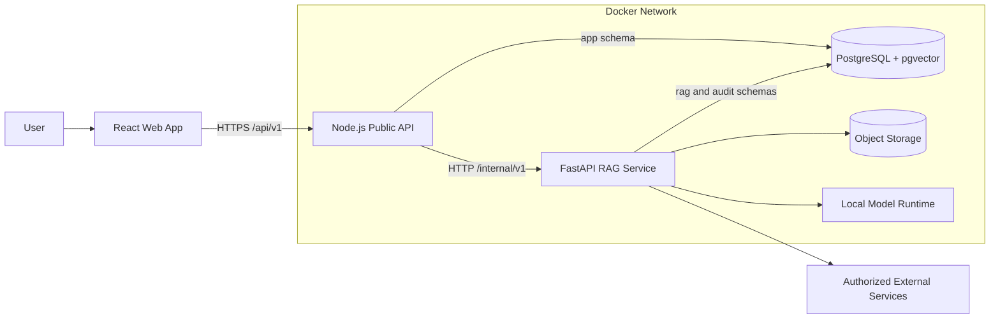

# System Architecture - IP-SAKTI Sahayak

## 1. Architectural goals

The system follows two principles:

> The language model explains evidence; it does not become the legal database.

> Node.js owns the public application workflow; FastAPI owns the AI/RAG workflow.

This split keeps normal product operations simple while allowing Python-native document, embedding, reranking and model libraries to remain inside the RAG service.

## 2. Service responsibilities

| Component | Owns | Must not own |
|---|---|---|
| React web app | UI state, forms, chat rendering, evidence display, voice capture | database access, model calls, secrets |
| Node.js API | public REST API, JWT/auth, users, sessions, messages, consent, rate limits, request orchestration, response persistence | embeddings, vector search, prompts, direct model logic |
| FastAPI RAG service | query understanding, classification, ingestion, hybrid retrieval, reranking, grounded generation, citation verification, language/model adapters | public authentication, user CRUD, browser-facing routes |
| PostgreSQL + pgvector | application records, corpus metadata, vectors, retrieval/audit records | business orchestration |
| Object storage | original PDFs, parsed/OCR artifacts, corpus manifests | mutable application records |

## 3. Logical architecture



Only the web app and Node.js API are exposed outside the private Docker network. FastAPI, PostgreSQL, object storage and model endpoints are internal services.

## 4. Request classes

### 4.1 Normal application request

Examples: login, create session, list messages, update preferences, read escalation status.

```text
Web -> Node.js -> PostgreSQL(app schema) -> Node.js -> Web
```

FastAPI is not involved.

### 4.2 RAG chat request

```text
Web
  -> Node.js: authenticate, validate, persist user message
  -> FastAPI: internal RAG request with correlation IDs
  -> PostgreSQL: filtered lexical + vector retrieval
  -> model: grounded draft
  -> verifier: citations and confidence
  -> Node.js: persist final answer and public response
  -> Web: render answer, evidence and decision
```

### 4.3 Ingestion request

An admin asks Node.js to start ingestion. Node.js authorizes the action and creates a job request. FastAPI performs fetch, parsing/OCR, chunking, embedding and corpus validation asynchronously. Long-running ingestion must return `202 Accepted` with a job ID rather than hold an HTTP request open.

## 5. Public and internal contracts

### Public Node.js API

Base path: `/api/v1`

- accepts browser traffic;
- verifies access tokens and permissions;
- applies public rate and payload limits;
- owns idempotency for mutating requests;
- returns the stable client-facing error format.

### Internal FastAPI API

Base path: `/internal/v1`

- accepts traffic only from Node.js or authorized workers;
- requires a service credential or signed service token;
- accepts `trace_id`, `request_id`, `session_id` and `message_id` for correlation;
- returns structured results, never UI-formatted HTML;
- is not reachable from the browser or public ingress.

Initial internal endpoints:

```text
POST /internal/v1/rag/query
POST /internal/v1/classify
POST /internal/v1/evidence/search
POST /internal/v1/ingestion/jobs
GET  /internal/v1/ingestion/jobs/{job_id}
GET  /internal/v1/health
```

## 6. RAG request lifecycle

1. Node.js authenticates the user, validates the public request and stores the user message.
2. Node.js calls FastAPI with IDs and normalized product/jurisdiction context.
3. FastAPI normalizes Unicode, detects language and redacts sensitive log fields.
4. The classifier produces intent, product category, legal domains and required follow-up questions.
5. Retrieval applies hard jurisdiction, legal-domain, source-status and effective-date filters.
6. PostgreSQL full-text and pgvector candidates are fused and reranked.
7. The context builder selects approximately 6-12 evidence units within the token budget.
8. The model generates only from supplied evidence and emits citation IDs.
9. The verifier checks claim support, source permissions, citation validity and contradictions.
10. FastAPI returns `PASS`, `PASS_WITH_CAUTION`, `ABSTAIN` or `ESCALATE` with evidence metadata.
11. Node.js stores the answer, claims/citations summary and audit correlation, then returns the public response.

Example internal query object:

```json
{
  "request_id": "uuid",
  "trace_id": "uuid",
  "session_id": "uuid",
  "message_id": "uuid",
  "query": "Can I patent this neem formulation?",
  "language": "en",
  "jurisdiction": "INDIA",
  "product_context": {
    "ingredients": ["neem"]
  }
}
```

## 7. PostgreSQL ownership

One Dockerized PostgreSQL instance is sufficient for the MVP, but ownership is separated by schemas and credentials:

| Schema | Writer | Main data |
|---|---|---|
| `app` | Node.js | organizations, users, sessions, messages, answers, consent, escalations |
| `rag` | FastAPI | sources, documents, chunks, embeddings, corpus versions, retrieval runs |
| `audit` | both through append-only repositories | security and processing events |

Rules:

- Node.js does not write `rag` tables.
- FastAPI does not modify users, sessions or messages.
- shared identifiers are UUIDs supplied in service contracts.
- each service uses a separate least-privilege database role.
- platform migrations create extensions and schemas before service migrations run.

## 8. MVP deployment

```text
Internet
  -> reverse proxy
      -> web container
      -> Node.js API container
            -> FastAPI RAG container
            -> PostgreSQL + pgvector container
            -> optional Redis container
            -> object storage container
            -> local model runtime
```

For the SIH demo, Docker Compose runs the stack on one host. A production deployment may scale Node.js, FastAPI workers and model serving independently without changing the public API.

## 9. Timeouts and resilience

Recommended starting budgets:

| Operation | Timeout | Behavior |
|---|---:|---|
| Node.js -> FastAPI chat | 60 s | return a traceable `503`/`504`; never invent an answer |
| FastAPI -> registry adapter | 5 s | mark live data unavailable and continue with corpus evidence where valid |
| embedding/reranker call | 15 s | retry once for transient failure, then abstain |
| local LLM generation | 45 s | cancel work and return service-unavailable decision |
| ordinary Node.js DB request | 5 s | fail fast and log correlation ID |

Use bounded retries with jitter only for idempotent operations. A browser retry must not duplicate messages or ingestion jobs; use an `Idempotency-Key` on public mutating endpoints.

## 10. Observability

Propagate these fields across Node.js, FastAPI and database audit records:

```text
trace_id
request_id
user_id (redacted where required)
session_id
message_id
retrieval_run_id
answer_id
corpus_version_id
```

Log structured metadata and hashes rather than raw confidential questions. Track p50/p95 latency separately for Node.js, retrieval, reranking, generation and verification.

## 11. Failure isolation

- FastAPI unavailable: ordinary Node.js endpoints remain available; RAG routes return a clear service-unavailable response.
- IP India or another registry unavailable: mark the dynamic lookup unavailable; corpus RAG can continue when appropriate.
- BHASHINI unavailable: fall back to supported text language; do not silently mistranslate.
- embedding service unavailable: retry within budget, then abstain.
- model unavailable: return an error or queued status, never generate from memory.
- PostgreSQL unavailable: both services fail readiness and stop accepting dependent work.
- optional Neo4j unavailable: graph-assisted reasoning is disabled; base RAG remains usable.

## 12. Scale-out path

The first scale step is independent replicas for Node.js and FastAPI behind internal/public load balancers. Add Redis only when distributed rate limiting, caching or a task queue is required. Add dedicated model hosts or OpenSearch only after measurements show PostgreSQL or local inference is the bottleneck. Neo4j remains optional and is not required for the MVP.
