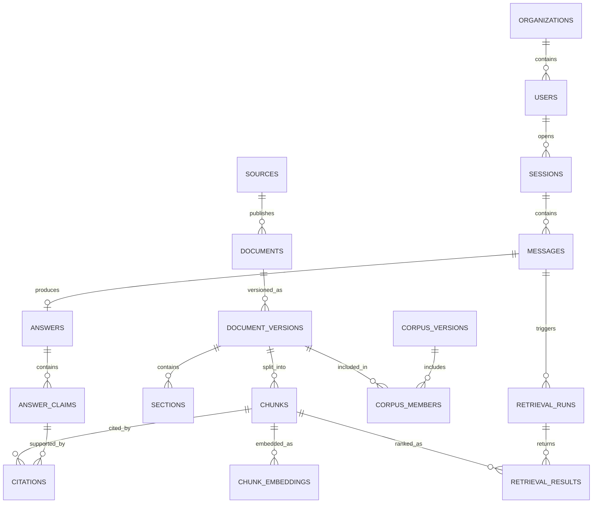

# PostgreSQL Database Schema

## 1. Database decision

Use one PostgreSQL instance with `pgvector` for the SIH MVP. Run it as a Docker service and separate ownership with schemas and database roles.

| Schema | Owner | Purpose |
|---|---|---|
| `app` | Node.js API | users, sessions, messages, answers, consent and escalations |
| `rag` | FastAPI service | corpus, chunks, vectors, classification, retrieval and ingestion |
| `audit` | append-only access from both | security and processing events |

This keeps deployment small while preventing both services from writing every table. Separate databases may be introduced later without changing the public API.

## 2. Data ownership rules

1. Node.js is the only writer to `app` tables.
2. FastAPI is the only writer to `rag` tables.
3. Both services may append to `audit.events`; neither may update or delete audit rows in normal operation.
4. FastAPI receives `session_id` and `message_id` from Node.js and uses them only as correlation IDs.
5. Legal document versions and answer records are immutable. Corrections create new versions or new answers.
6. Raw documents live in object storage; PostgreSQL stores their URI, checksum and extracted searchable text.
7. Store timestamps as `TIMESTAMPTZ` in UTC and generate public identifiers as UUIDs.

## 3. Relationship overview



## 4. Platform migration

Run this migration before either service migration:

```sql
CREATE EXTENSION IF NOT EXISTS pgcrypto;
CREATE EXTENSION IF NOT EXISTS vector;

CREATE SCHEMA IF NOT EXISTS app;
CREATE SCHEMA IF NOT EXISTS rag;
CREATE SCHEMA IF NOT EXISTS audit;

CREATE OR REPLACE FUNCTION audit.set_updated_at()
RETURNS trigger
LANGUAGE plpgsql
AS $$
BEGIN
    NEW.updated_at = now();
    RETURN NEW;
END;
$$;
```

`pgcrypto` supplies `gen_random_uuid()`. Pin a pgvector-enabled PostgreSQL image in Docker; do not depend on installing the extension manually during a demo.

## 5. RAG schema - FastAPI owned

### 5.1 Reference and source tables

```sql
CREATE TABLE rag.jurisdictions (
    code text PRIMARY KEY,
    name text NOT NULL,
    active boolean NOT NULL DEFAULT true
);

CREATE TABLE rag.legal_domains (
    code text PRIMARY KEY,
    name text NOT NULL,
    active boolean NOT NULL DEFAULT true
);

CREATE TABLE rag.sources (
    id uuid PRIMARY KEY DEFAULT gen_random_uuid(),
    source_key text NOT NULL UNIQUE,
    authority_name text NOT NULL,
    canonical_url text NOT NULL,
    jurisdiction_code text NOT NULL
        REFERENCES rag.jurisdictions(code),
    legal_domain_code text NOT NULL
        REFERENCES rag.legal_domains(code),
    source_type text NOT NULL CHECK (
        source_type IN ('LAW', 'RULE', 'REGULATION', 'TREATY', 'GUIDANCE', 'REGISTRY', 'CASE_LAW')
    ),
    access_policy text NOT NULL DEFAULT 'PUBLIC' CHECK (
        access_policy IN ('PUBLIC', 'POINTER_ONLY', 'RESTRICTED')
    ),
    refresh_policy text,
    active boolean NOT NULL DEFAULT true,
    created_at timestamptz NOT NULL DEFAULT now(),
    updated_at timestamptz NOT NULL DEFAULT now()
);

CREATE TRIGGER trg_sources_updated_at
BEFORE UPDATE ON rag.sources
FOR EACH ROW EXECUTE FUNCTION audit.set_updated_at();

CREATE TABLE rag.documents (
    id uuid PRIMARY KEY DEFAULT gen_random_uuid(),
    source_id uuid NOT NULL REFERENCES rag.sources(id) ON DELETE RESTRICT,
    title text NOT NULL,
    instrument_type text,
    external_identifier text,
    canonical_url text,
    created_at timestamptz NOT NULL DEFAULT now(),
    UNIQUE (source_id, external_identifier)
);

CREATE TABLE rag.document_versions (
    id uuid PRIMARY KEY DEFAULT gen_random_uuid(),
    document_id uuid NOT NULL REFERENCES rag.documents(id) ON DELETE RESTRICT,
    sha256 char(64) NOT NULL CHECK (sha256 ~ '^[0-9a-f]{64}$'),
    publication_date date,
    effective_from date,
    effective_to date,
    retrieved_at timestamptz NOT NULL,
    storage_uri text NOT NULL,
    extraction_method text CHECK (
        extraction_method IS NULL OR extraction_method IN ('HTML', 'PDF_TEXT', 'OCR', 'MANUAL')
    ),
    extraction_quality numeric(5,4) CHECK (
        extraction_quality IS NULL OR extraction_quality BETWEEN 0 AND 1
    ),
    parser_version text,
    status text NOT NULL DEFAULT 'STAGED' CHECK (
        status IN ('STAGED', 'VALIDATED', 'ACTIVE', 'RETIRED', 'REJECTED')
    ),
    created_at timestamptz NOT NULL DEFAULT now(),
    CHECK (effective_to IS NULL OR effective_from IS NULL OR effective_to >= effective_from),
    UNIQUE (document_id, sha256)
);

CREATE TABLE rag.document_tags (
    document_id uuid NOT NULL REFERENCES rag.documents(id) ON DELETE CASCADE,
    tag text NOT NULL,
    PRIMARY KEY (document_id, tag)
);
```

### 5.2 Sections, chunks and embeddings

```sql
CREATE TABLE rag.sections (
    id uuid PRIMARY KEY DEFAULT gen_random_uuid(),
    document_version_id uuid NOT NULL
        REFERENCES rag.document_versions(id) ON DELETE CASCADE,
    parent_id uuid REFERENCES rag.sections(id) ON DELETE SET NULL,
    section_index integer NOT NULL CHECK (section_index >= 0),
    label text,
    heading text,
    level integer NOT NULL CHECK (level >= 0),
    page_start integer CHECK (page_start IS NULL OR page_start > 0),
    page_end integer CHECK (page_end IS NULL OR page_end > 0),
    CHECK (page_end IS NULL OR page_start IS NULL OR page_end >= page_start),
    UNIQUE (document_version_id, section_index)
);

CREATE TABLE rag.chunks (
    id uuid PRIMARY KEY DEFAULT gen_random_uuid(),
    document_version_id uuid NOT NULL
        REFERENCES rag.document_versions(id) ON DELETE CASCADE,
    section_id uuid REFERENCES rag.sections(id) ON DELETE SET NULL,
    chunk_index integer NOT NULL CHECK (chunk_index >= 0),
    text text NOT NULL CHECK (length(btrim(text)) > 0),
    normalized_text text,
    token_count integer CHECK (token_count IS NULL OR token_count > 0),
    language varchar(16) NOT NULL DEFAULT 'en',
    low_quality boolean NOT NULL DEFAULT false,
    page_start integer CHECK (page_start IS NULL OR page_start > 0),
    page_end integer CHECK (page_end IS NULL OR page_end > 0),
    metadata jsonb NOT NULL DEFAULT '{}'::jsonb,
    search_vector tsvector GENERATED ALWAYS AS (
        to_tsvector('simple', coalesce(normalized_text, text))
    ) STORED,
    created_at timestamptz NOT NULL DEFAULT now(),
    CHECK (page_end IS NULL OR page_start IS NULL OR page_end >= page_start),
    UNIQUE (document_version_id, chunk_index)
);

CREATE TABLE rag.chunk_embeddings (
    chunk_id uuid NOT NULL REFERENCES rag.chunks(id) ON DELETE CASCADE,
    model_name text NOT NULL,
    model_version text NOT NULL,
    embedding vector(768) NOT NULL,
    created_at timestamptz NOT NULL DEFAULT now(),
    PRIMARY KEY (chunk_id, model_name, model_version)
);

CREATE INDEX idx_chunks_version ON rag.chunks(document_version_id);
CREATE INDEX idx_chunks_section ON rag.chunks(section_id);
CREATE INDEX idx_chunks_metadata_gin ON rag.chunks USING gin(metadata);
CREATE INDEX idx_chunks_search_gin ON rag.chunks USING gin(search_vector);

-- Create after representative embeddings exist and tune m/ef_construction with measurements.
CREATE INDEX idx_chunk_embeddings_hnsw
ON rag.chunk_embeddings
USING hnsw (embedding vector_cosine_ops);
```

The `vector(768)` dimension is a migration invariant. If the selected model has another dimension, change the migration before ingesting data. Never silently truncate or pad vectors.

### 5.3 Corpus lifecycle

```sql
CREATE TABLE rag.corpus_versions (
    id uuid PRIMARY KEY DEFAULT gen_random_uuid(),
    name text NOT NULL UNIQUE,
    manifest_uri text NOT NULL,
    manifest_sha256 char(64) NOT NULL CHECK (manifest_sha256 ~ '^[0-9a-f]{64}$'),
    embedding_model text NOT NULL,
    embedding_dimension integer NOT NULL CHECK (embedding_dimension > 0),
    status text NOT NULL CHECK (
        status IN ('BUILDING', 'VALIDATING', 'READY', 'ACTIVE', 'RETIRED', 'FAILED')
    ),
    created_at timestamptz NOT NULL DEFAULT now(),
    activated_at timestamptz,
    retired_at timestamptz
);

CREATE UNIQUE INDEX uq_one_active_corpus
ON rag.corpus_versions ((status))
WHERE status = 'ACTIVE';

CREATE TABLE rag.corpus_members (
    corpus_version_id uuid NOT NULL
        REFERENCES rag.corpus_versions(id) ON DELETE CASCADE,
    document_version_id uuid NOT NULL
        REFERENCES rag.document_versions(id) ON DELETE RESTRICT,
    PRIMARY KEY (corpus_version_id, document_version_id)
);

CREATE TABLE rag.ingestion_runs (
    id uuid PRIMARY KEY DEFAULT gen_random_uuid(),
    requested_by_user_id uuid,
    source_id uuid REFERENCES rag.sources(id) ON DELETE SET NULL,
    corpus_version_id uuid REFERENCES rag.corpus_versions(id) ON DELETE SET NULL,
    idempotency_key text UNIQUE,
    status text NOT NULL CHECK (
        status IN ('QUEUED', 'FETCHING', 'PARSING', 'EMBEDDING', 'VALIDATING', 'SUCCEEDED', 'FAILED', 'CANCELLED')
    ),
    counters jsonb NOT NULL DEFAULT '{}'::jsonb,
    error_summary text,
    started_at timestamptz,
    completed_at timestamptz,
    created_at timestamptz NOT NULL DEFAULT now()
);
```

Activate a corpus in one transaction: lock corpus rows, retire the current active row, activate the selected `READY` row, and commit. Never publish a partially ingested corpus.

## 6. Application schema - Node.js owned

```sql
CREATE TABLE app.organizations (
    id uuid PRIMARY KEY DEFAULT gen_random_uuid(),
    name text NOT NULL,
    organization_type text,
    created_at timestamptz NOT NULL DEFAULT now(),
    updated_at timestamptz NOT NULL DEFAULT now()
);

CREATE TABLE app.users (
    id uuid PRIMARY KEY DEFAULT gen_random_uuid(),
    organization_id uuid REFERENCES app.organizations(id) ON DELETE SET NULL,
    email text,
    display_name text,
    role text NOT NULL DEFAULT 'USER' CHECK (
        role IN ('USER', 'EXPERT', 'ADMIN', 'INGESTION_SERVICE', 'EVALUATION')
    ),
    status text NOT NULL DEFAULT 'ACTIVE' CHECK (
        status IN ('ACTIVE', 'DISABLED', 'DELETED')
    ),
    created_at timestamptz NOT NULL DEFAULT now(),
    updated_at timestamptz NOT NULL DEFAULT now()
);

CREATE UNIQUE INDEX uq_users_email_lower
ON app.users (lower(email))
WHERE email IS NOT NULL AND status <> 'DELETED';

CREATE TABLE app.sessions (
    id uuid PRIMARY KEY DEFAULT gen_random_uuid(),
    user_id uuid REFERENCES app.users(id) ON DELETE SET NULL,
    title text,
    jurisdiction_code text NOT NULL DEFAULT 'INDIA',
    language varchar(16) NOT NULL DEFAULT 'en',
    status text NOT NULL DEFAULT 'ACTIVE' CHECK (
        status IN ('ACTIVE', 'ARCHIVED', 'DELETED')
    ),
    created_at timestamptz NOT NULL DEFAULT now(),
    updated_at timestamptz NOT NULL DEFAULT now()
);

CREATE TABLE app.messages (
    id uuid PRIMARY KEY DEFAULT gen_random_uuid(),
    session_id uuid NOT NULL REFERENCES app.sessions(id) ON DELETE CASCADE,
    role text NOT NULL CHECK (role IN ('USER', 'ASSISTANT', 'SYSTEM')),
    content text NOT NULL CHECK (length(btrim(content)) > 0),
    language varchar(16),
    client_message_id text,
    created_at timestamptz NOT NULL DEFAULT now(),
    UNIQUE (session_id, client_message_id)
);

CREATE INDEX idx_sessions_user_updated ON app.sessions(user_id, updated_at DESC);
CREATE INDEX idx_messages_session_created ON app.messages(session_id, created_at, id);

CREATE TRIGGER trg_organizations_updated_at
BEFORE UPDATE ON app.organizations
FOR EACH ROW EXECUTE FUNCTION audit.set_updated_at();

CREATE TRIGGER trg_users_updated_at
BEFORE UPDATE ON app.users
FOR EACH ROW EXECUTE FUNCTION audit.set_updated_at();

CREATE TRIGGER trg_sessions_updated_at
BEFORE UPDATE ON app.sessions
FOR EACH ROW EXECUTE FUNCTION audit.set_updated_at();
```

Use `client_message_id` or the public `Idempotency-Key` to prevent duplicate chat messages when a browser retries.

### 6.1 Answers, claims and citations

```sql
CREATE TABLE app.answers (
    id uuid PRIMARY KEY DEFAULT gen_random_uuid(),
    user_message_id uuid NOT NULL UNIQUE
        REFERENCES app.messages(id) ON DELETE RESTRICT,
    assistant_message_id uuid UNIQUE
        REFERENCES app.messages(id) ON DELETE RESTRICT,
    retrieval_run_id uuid,
    corpus_version_id uuid REFERENCES rag.corpus_versions(id) ON DELETE RESTRICT,
    model_name text NOT NULL,
    model_version text,
    policy_version text NOT NULL,
    decision text NOT NULL CHECK (
        decision IN ('PASS', 'PASS_WITH_CAUTION', 'ABSTAIN', 'ESCALATE')
    ),
    confidence numeric(5,4) CHECK (confidence IS NULL OR confidence BETWEEN 0 AND 1),
    answer_text text NOT NULL,
    missing_information jsonb NOT NULL DEFAULT '[]'::jsonb,
    created_at timestamptz NOT NULL DEFAULT now()
);

CREATE TABLE app.answer_claims (
    id uuid PRIMARY KEY DEFAULT gen_random_uuid(),
    answer_id uuid NOT NULL REFERENCES app.answers(id) ON DELETE CASCADE,
    claim_index integer NOT NULL CHECK (claim_index >= 0),
    claim_text text NOT NULL,
    support_status text NOT NULL CHECK (
        support_status IN ('SUPPORTED', 'PARTIAL', 'UNSUPPORTED', 'NOT_APPLICABLE')
    ),
    verifier_score numeric(5,4) CHECK (
        verifier_score IS NULL OR verifier_score BETWEEN 0 AND 1
    ),
    UNIQUE (answer_id, claim_index),
    UNIQUE (id, answer_id)
);

CREATE TABLE app.citations (
    id uuid PRIMARY KEY DEFAULT gen_random_uuid(),
    answer_id uuid NOT NULL REFERENCES app.answers(id) ON DELETE CASCADE,
    claim_id uuid,
    chunk_id uuid NOT NULL REFERENCES rag.chunks(id) ON DELETE RESTRICT,
    citation_label text NOT NULL,
    authority_snapshot text NOT NULL,
    document_title_snapshot text NOT NULL,
    locator_snapshot text,
    quoted_span text,
    source_url_snapshot text,
    page_start integer,
    page_end integer,
    created_at timestamptz NOT NULL DEFAULT now(),
    FOREIGN KEY (claim_id, answer_id)
        REFERENCES app.answer_claims(id, answer_id) ON DELETE CASCADE,
    UNIQUE (answer_id, citation_label),
    CHECK (page_end IS NULL OR page_start IS NULL OR page_end >= page_start)
);

CREATE INDEX idx_answers_created ON app.answers(created_at DESC);
CREATE INDEX idx_citations_chunk ON app.citations(chunk_id);
```

Citation snapshot fields preserve what the user saw even if source metadata later changes. The `chunk_id` still provides full provenance.

### 6.2 Consent and escalation

```sql
CREATE TABLE app.consent_records (
    id uuid PRIMARY KEY DEFAULT gen_random_uuid(),
    user_id uuid NOT NULL REFERENCES app.users(id) ON DELETE RESTRICT,
    purpose text NOT NULL,
    notice_version text NOT NULL,
    granted boolean NOT NULL,
    granted_at timestamptz,
    revoked_at timestamptz,
    created_at timestamptz NOT NULL DEFAULT now(),
    CHECK (NOT granted OR granted_at IS NOT NULL)
);

CREATE TABLE app.escalations (
    id uuid PRIMARY KEY DEFAULT gen_random_uuid(),
    answer_id uuid REFERENCES app.answers(id) ON DELETE SET NULL,
    user_id uuid REFERENCES app.users(id) ON DELETE SET NULL,
    assigned_expert_id uuid REFERENCES app.users(id) ON DELETE SET NULL,
    consent_record_id uuid REFERENCES app.consent_records(id) ON DELETE RESTRICT,
    reason text NOT NULL,
    case_payload jsonb NOT NULL DEFAULT '{}'::jsonb,
    status text NOT NULL DEFAULT 'OPEN' CHECK (
        status IN ('OPEN', 'ASSIGNED', 'IN_REVIEW', 'RESOLVED', 'CLOSED', 'CANCELLED')
    ),
    created_at timestamptz NOT NULL DEFAULT now(),
    updated_at timestamptz NOT NULL DEFAULT now()
);

CREATE INDEX idx_escalations_assignee_status
ON app.escalations(assigned_expert_id, status, created_at);

CREATE TRIGGER trg_escalations_updated_at
BEFORE UPDATE ON app.escalations
FOR EACH ROW EXECUTE FUNCTION audit.set_updated_at();
```

## 7. RAG runtime records

```sql
CREATE TABLE rag.classifications (
    id uuid PRIMARY KEY DEFAULT gen_random_uuid(),
    session_id uuid NOT NULL,
    message_id uuid NOT NULL,
    category text NOT NULL,
    confidence numeric(5,4) CHECK (confidence IS NULL OR confidence BETWEEN 0 AND 1),
    legal_domains text[] NOT NULL DEFAULT '{}',
    evidence jsonb NOT NULL DEFAULT '{}'::jsonb,
    needs_more_info boolean NOT NULL DEFAULT false,
    model_version text,
    rules_version text NOT NULL,
    created_at timestamptz NOT NULL DEFAULT now()
);

CREATE TABLE rag.retrieval_runs (
    id uuid PRIMARY KEY DEFAULT gen_random_uuid(),
    request_id uuid NOT NULL UNIQUE,
    trace_id uuid NOT NULL,
    session_id uuid NOT NULL,
    message_id uuid NOT NULL,
    corpus_version_id uuid NOT NULL
        REFERENCES rag.corpus_versions(id) ON DELETE RESTRICT,
    query_hash char(64) NOT NULL CHECK (query_hash ~ '^[0-9a-f]{64}$'),
    query_text text,
    filters jsonb NOT NULL DEFAULT '{}'::jsonb,
    embedding_model text NOT NULL,
    reranker_model text,
    lexical_top_k integer NOT NULL CHECK (lexical_top_k > 0),
    vector_top_k integer NOT NULL CHECK (vector_top_k > 0),
    context_top_k integer NOT NULL CHECK (context_top_k > 0),
    duration_ms integer CHECK (duration_ms IS NULL OR duration_ms >= 0),
    status text NOT NULL CHECK (status IN ('STARTED', 'SUCCEEDED', 'EMPTY', 'FAILED')),
    created_at timestamptz NOT NULL DEFAULT now()
);

CREATE TABLE rag.retrieval_results (
    id uuid PRIMARY KEY DEFAULT gen_random_uuid(),
    retrieval_run_id uuid NOT NULL
        REFERENCES rag.retrieval_runs(id) ON DELETE CASCADE,
    chunk_id uuid NOT NULL REFERENCES rag.chunks(id) ON DELETE RESTRICT,
    lexical_score double precision,
    vector_score double precision,
    fused_score double precision,
    rerank_score double precision,
    rank integer NOT NULL CHECK (rank > 0),
    selected_for_context boolean NOT NULL DEFAULT false,
    UNIQUE (retrieval_run_id, chunk_id),
    UNIQUE (retrieval_run_id, rank)
);

CREATE INDEX idx_classifications_message ON rag.classifications(message_id, created_at DESC);
CREATE INDEX idx_retrieval_runs_message ON rag.retrieval_runs(message_id, created_at DESC);
CREATE INDEX idx_retrieval_results_run_rank ON rag.retrieval_results(retrieval_run_id, rank);
```

`session_id` and `message_id` deliberately have no cross-schema foreign keys here. They are correlation identifiers from the Node.js contract, which keeps FastAPI migrations independent from application-table lifecycle operations.

### 7.1 Live registry calls

```sql
CREATE TABLE rag.registry_queries (
    id uuid PRIMARY KEY DEFAULT gen_random_uuid(),
    request_id uuid NOT NULL,
    message_id uuid NOT NULL,
    adapter_name text NOT NULL,
    query_hash char(64) NOT NULL CHECK (query_hash ~ '^[0-9a-f]{64}$'),
    query_payload jsonb,
    requested_at timestamptz NOT NULL DEFAULT now(),
    completed_at timestamptz,
    status text NOT NULL CHECK (status IN ('STARTED', 'SUCCEEDED', 'UNAVAILABLE', 'FAILED'))
);

CREATE TABLE rag.registry_results (
    id uuid PRIMARY KEY DEFAULT gen_random_uuid(),
    registry_query_id uuid NOT NULL
        REFERENCES rag.registry_queries(id) ON DELETE CASCADE,
    result_json jsonb NOT NULL,
    retrieved_at timestamptz NOT NULL,
    source_url text NOT NULL
);
```

Encrypt or omit sensitive `query_payload` values. Cache only where the official source permits it and always return `retrieved_at`.

## 8. Append-only audit schema

```sql
CREATE TABLE audit.events (
    id bigint GENERATED ALWAYS AS IDENTITY PRIMARY KEY,
    occurred_at timestamptz NOT NULL DEFAULT now(),
    trace_id uuid,
    request_id uuid,
    actor_type text NOT NULL CHECK (
        actor_type IN ('USER', 'EXPERT', 'ADMIN', 'NODE_API', 'RAG_SERVICE', 'WORKER', 'SYSTEM')
    ),
    actor_id uuid,
    event_type text NOT NULL,
    entity_type text,
    entity_id uuid,
    outcome text,
    event_data jsonb NOT NULL DEFAULT '{}'::jsonb
);

CREATE INDEX idx_audit_events_time ON audit.events(occurred_at DESC);
CREATE INDEX idx_audit_events_trace ON audit.events(trace_id) WHERE trace_id IS NOT NULL;
CREATE INDEX idx_audit_events_entity ON audit.events(entity_type, entity_id)
WHERE entity_id IS NOT NULL;
```

Application roles receive `INSERT` and required `SELECT` only. Data-retention deletion must be a separately authorized administrative process, not a normal service capability.

## 9. Service roles and grants

Create login roles and passwords through deployment secrets, not inside committed SQL. The migration owner applies DDL, then grants runtime permissions:

```sql
GRANT USAGE ON SCHEMA app, audit TO node_runtime;
GRANT SELECT, INSERT, UPDATE, DELETE ON ALL TABLES IN SCHEMA app TO node_runtime;
GRANT USAGE, SELECT ON ALL SEQUENCES IN SCHEMA app, audit TO node_runtime;
GRANT SELECT ON rag.corpus_versions, rag.chunks TO node_runtime;
GRANT INSERT ON audit.events TO node_runtime;
GRANT EXECUTE ON FUNCTION audit.set_updated_at() TO node_runtime;

GRANT USAGE ON SCHEMA rag, audit TO rag_runtime;
GRANT SELECT, INSERT, UPDATE, DELETE ON ALL TABLES IN SCHEMA rag TO rag_runtime;
GRANT USAGE, SELECT ON ALL SEQUENCES IN SCHEMA rag, audit TO rag_runtime;
GRANT INSERT ON audit.events TO rag_runtime;
GRANT EXECUTE ON FUNCTION audit.set_updated_at() TO rag_runtime;

ALTER DEFAULT PRIVILEGES IN SCHEMA app
GRANT SELECT, INSERT, UPDATE, DELETE ON TABLES TO node_runtime;

ALTER DEFAULT PRIVILEGES IN SCHEMA rag
GRANT SELECT, INSERT, UPDATE, DELETE ON TABLES TO rag_runtime;
```

Do not grant either runtime role `CREATE`, superuser, extension-management or schema-owner privileges.

## 10. Migration ownership

```text
infra/migrations/platform/   extensions, schemas, shared functions, grants
apps/api-node/migrations/    app schema
services/rag-fastapi/alembic/ rag schema
infra/migrations/audit/      audit schema
```

Recommended tools:

- Node.js: Prisma, Drizzle or Knex migrations; choose one and keep it as the `app` schema authority.
- FastAPI: Alembic + SQLAlchemy for `rag` migrations.
- CI: create an empty database, apply every migration, run integrity smoke tests, then test downgrade/rollback strategy where supported.

Never let an ORM auto-synchronize production tables. Migrations are reviewed artifacts.

## 11. Docker configuration

Minimum PostgreSQL service shape:

```yaml
services:
  postgres:
    image: pgvector/pgvector:pg16
    environment:
      POSTGRES_DB: ipsakti
      POSTGRES_USER: migration_owner
      POSTGRES_PASSWORD: ${POSTGRES_MIGRATION_PASSWORD}
    volumes:
      - postgres_data:/var/lib/postgresql/data
    healthcheck:
      test: ["CMD-SHELL", "pg_isready -U migration_owner -d ipsakti"]
      interval: 5s
      timeout: 5s
      retries: 10
    networks:
      - backend
```

Pin the exact image patch or digest before the final SIH demo. PostgreSQL must not publish port `5432` on a public production interface.

## 12. Backup, retention and deletion

- Back up PostgreSQL daily and before schema changes.
- Back up corpus manifests and object-storage source files with checksums.
- Test restore into a clean environment before calling the backup process complete.
- Define separate retention for conversations, audit events, voice artifacts and ingestion artifacts.
- User deletion should pseudonymize audit references where retention is legally required and delete ordinary application content according to policy.
- Never cascade-delete a chunk that is cited by an answer; `ON DELETE RESTRICT` preserves evidence provenance.

## 13. Required database tests

The CI database suite must verify:

1. migrations apply to an empty PostgreSQL + pgvector database;
2. a second migration run is a no-op;
3. only one corpus can be `ACTIVE`;
4. duplicate client message IDs do not create duplicate messages;
5. vector dimensions match the configured embedding model;
6. jurisdiction and corpus filters exclude forbidden chunks;
7. an answer cannot cite a nonexistent chunk or a claim from another answer;
8. runtime roles cannot write another service's schema;
9. cited chunks cannot be deleted;
10. backup restore preserves source hashes, vectors, citations and audit correlation IDs.
