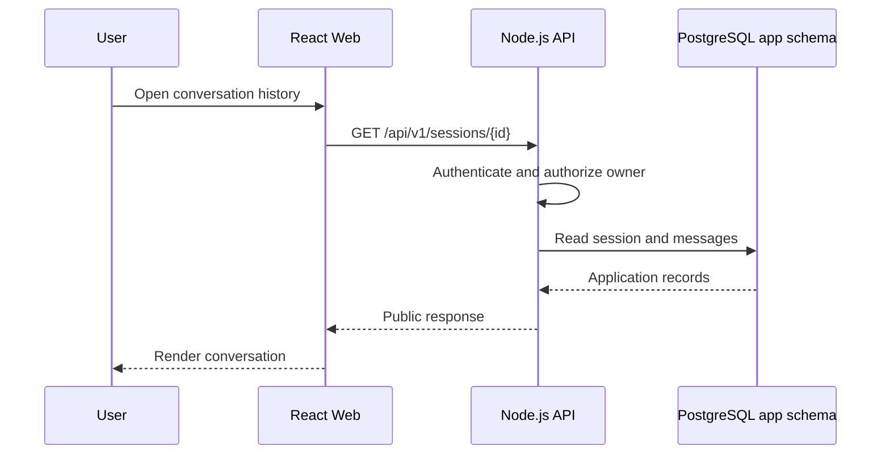
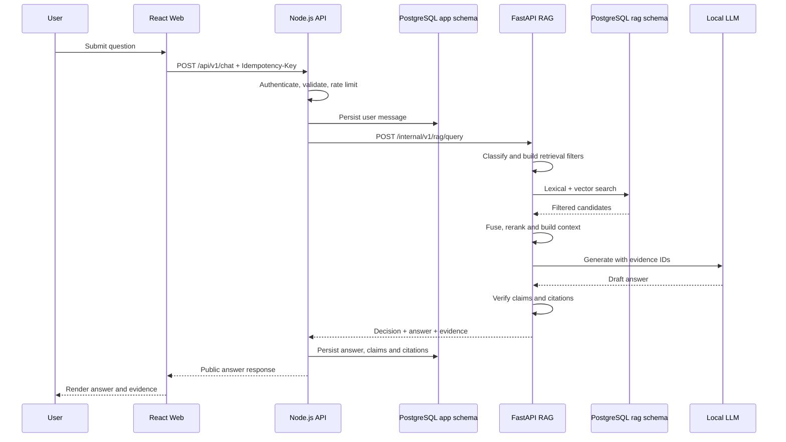
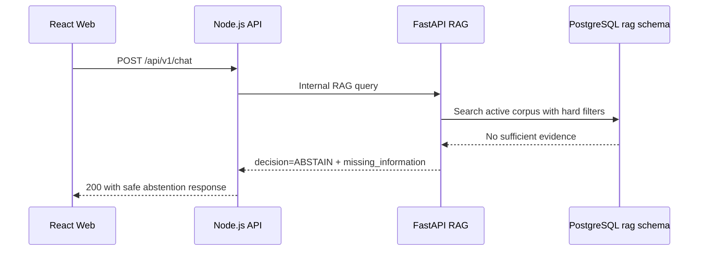
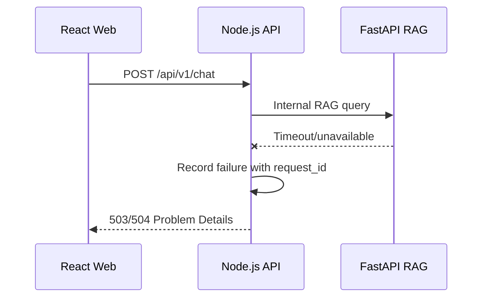
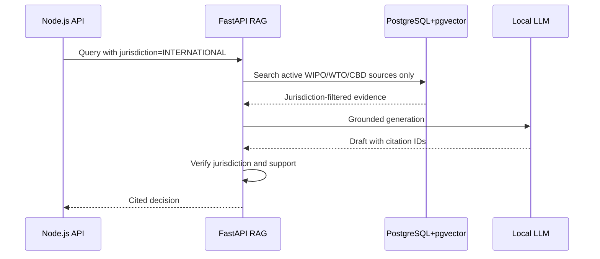
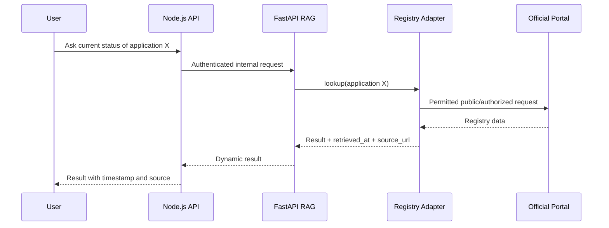
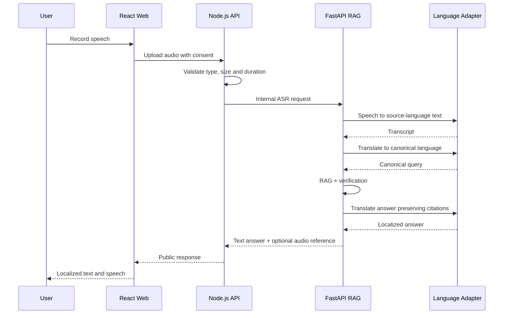
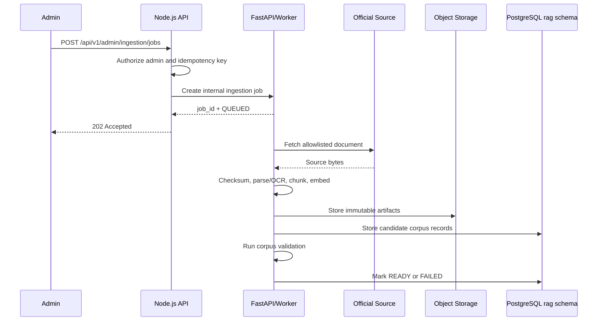
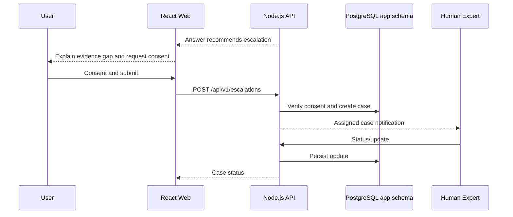

# Runtime Sequence Diagrams

## 1. Ordinary application request

FastAPI is not called for ordinary user, session, message or consent operations.

## 2. Standard India RAG chat

## 3. Safe abstention

Abstention is a valid RAG decision. It is not used to hide infrastructure errors.

## 4. FastAPI timeout or outage

Node.js does not generate a fallback legal answer from memory. Ordinary Node.js routes remain available.

## 5. International query

## 6. Live registry lookup

## 7. Voice query

## 8. Corpus ingestion

Corpus activation is a separate admin action after validation.

## 9. Escalation

