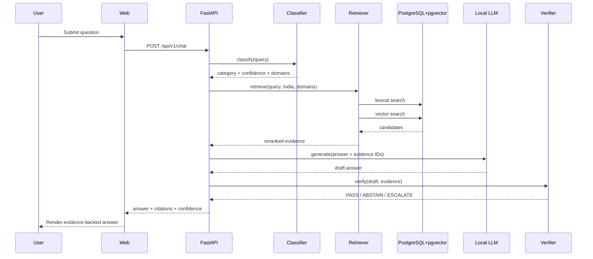
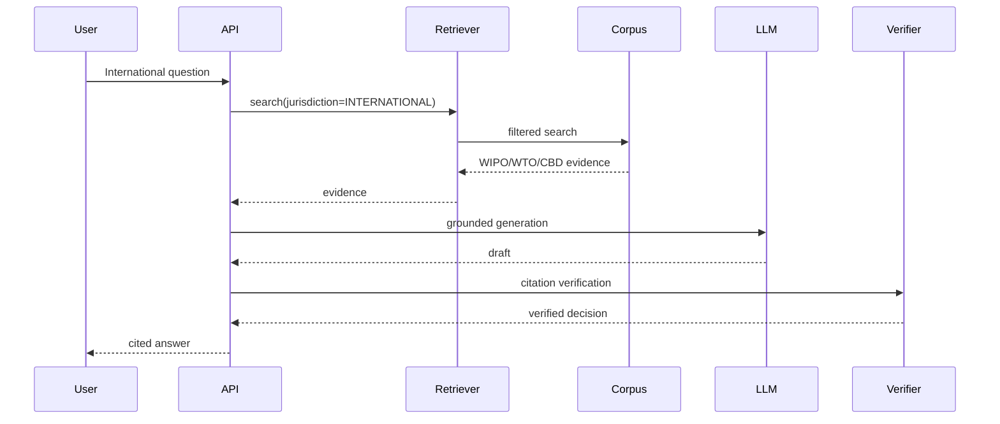
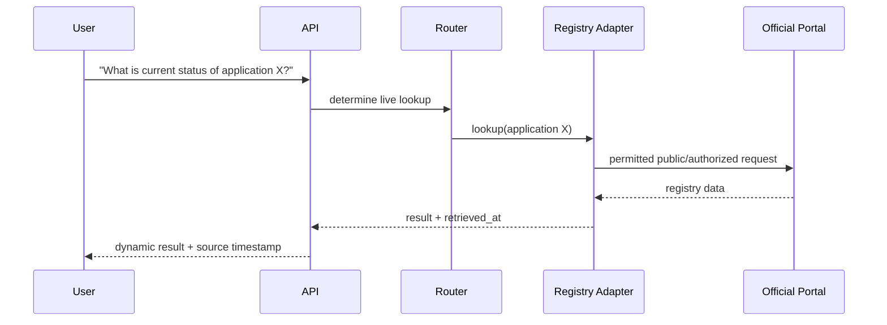
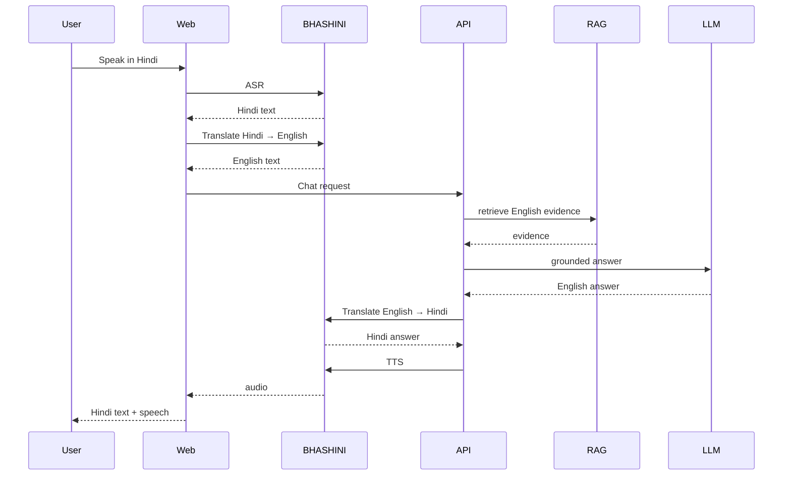
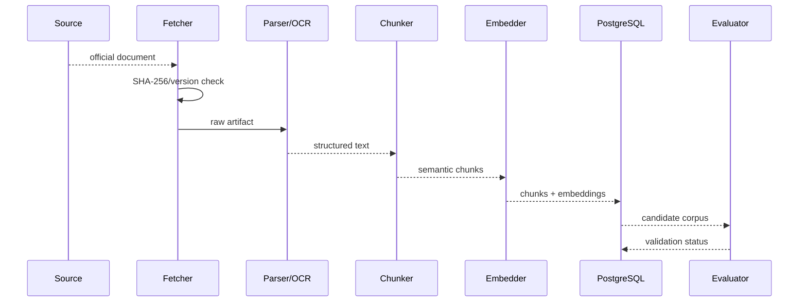
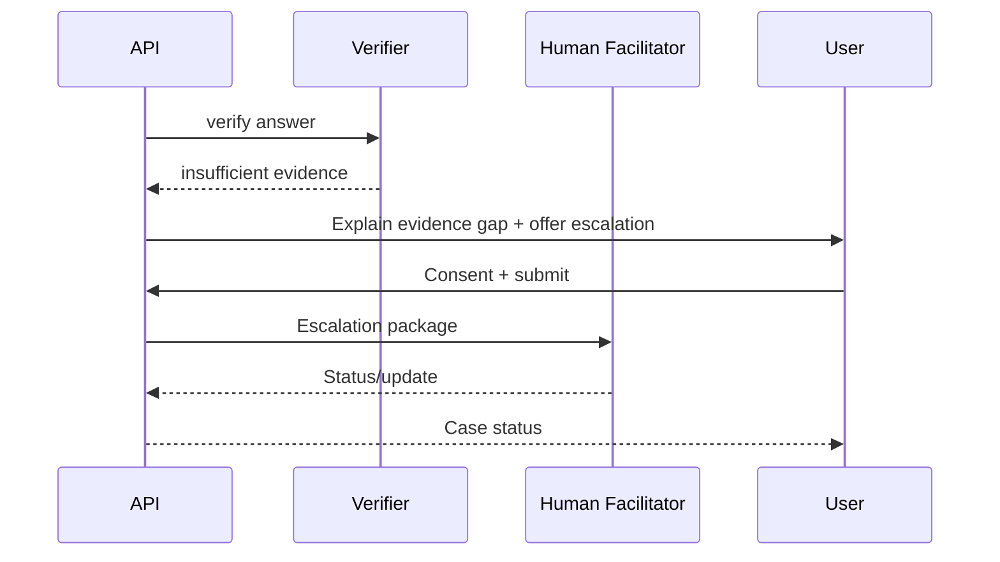

# Runtime Sequence Diagrams

## 1. Standard India chat

```mermaid
sequenceDiagram
    participant U as User
    participant W as Web
    participant A as FastAPI
    participant C as Classifier
    participant R as Retriever
    participant DB as PostgreSQL+pgvector
    participant L as Local LLM
    participant V as Verifier

    U->>W: Submit question
    W->>A: POST /api/v1/chat
    A->>C: classify(query)
    C-->>A: category + confidence + domains
    A->>R: retrieve(query, India, domains)
    R->>DB: lexical search
    R->>DB: vector search
    DB-->>R: candidates
    R-->>A: reranked evidence
    A->>L: generate(answer + evidence IDs)
    L-->>A: draft answer
    A->>V: verify(draft, evidence)
    V-->>A: PASS / ABSTAIN / ESCALATE
    A-->>W: answer + citations + confidence
    W-->>U: Render evidence-backed answer
```

## 2. International query

```mermaid
sequenceDiagram
    participant U as User
    participant A as API
    participant R as Retriever
    participant DB as Corpus
    participant L as LLM
    participant V as Verifier

    U->>A: International question
    A->>R: search(jurisdiction=INTERNATIONAL)
    R->>DB: filtered search
    DB-->>R: WIPO/WTO/CBD evidence
    R-->>A: evidence
    A->>L: grounded generation
    L-->>A: draft
    A->>V: citation verification
    V-->>A: verified decision
    A-->>U: cited answer
```

## 3. Live registry lookup

```mermaid
sequenceDiagram
    participant U as User
    participant A as API
    participant R as Router
    participant I as Registry Adapter
    participant P as Official Portal

    U->>A: "What is current status of application X?"
    A->>R: determine live lookup
    R->>I: lookup(application X)
    I->>P: permitted public/authorized request
    P-->>I: registry data
    I-->>A: result + retrieved_at
    A-->>U: dynamic result + source timestamp
```

## 4. Voice query

```mermaid
sequenceDiagram
    participant U as User
    participant W as Web
    participant B as BHASHINI
    participant A as API
    participant R as RAG
    participant L as LLM

    U->>W: Speak in Hindi
    W->>B: ASR
    B-->>W: Hindi text
    W->>B: Translate Hindi → English
    B-->>W: English text
    W->>A: Chat request
    A->>R: retrieve English evidence
    R-->>A: evidence
    A->>L: grounded answer
    L-->>A: English answer
    A->>B: Translate English → Hindi
    B-->>A: Hindi answer
    A->>B: TTS
    B-->>W: audio
    W-->>U: Hindi text + speech
```

## 5. Corpus ingestion

```mermaid
sequenceDiagram
    participant S as Source
    participant F as Fetcher
    participant P as Parser/OCR
    participant C as Chunker
    participant E as Embedder
    participant DB as PostgreSQL
    participant Q as Evaluator

    S-->>F: official document
    F->>F: SHA-256/version check
    F->>P: raw artifact
    P-->>C: structured text
    C-->>E: semantic chunks
    E-->>DB: chunks + embeddings
    DB-->>Q: candidate corpus
    Q-->>DB: validation status
```

## 6. Escalation

```mermaid
sequenceDiagram
    participant A as API
    participant V as Verifier
    participant H as Human Facilitator
    participant U as User

    A->>V: verify answer
    V-->>A: insufficient evidence
    A->>U: Explain evidence gap + offer escalation
    U->>A: Consent + submit
    A->>H: Escalation package
    H-->>A: Status/update
    A-->>U: Case status
```
